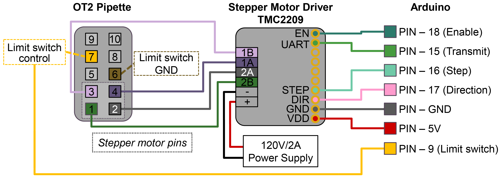

# Arduino Wiring

Electronics and wiring diagrams for the PANDA system's Arduino-based control system.

**Navigation**: [Home](00-Home.md) | [Build Guide](Build-Guide.md) | [Construction Guide](Construction.md) | Arduino Wiring

## Circuit Diagrams

### Pipette Control

Circuit diagram showing OT2 Pipette control interface with the Arduino.

### Arduino Control System

Complete circuit diagram showing Arduino control of all system modules.

## Arduino Firmware

The Arduino firmware and control code is maintained in a separate repository:

**Repository**: [BU-KABlab/PANDA_Arduino](https://github.com/BU-KABlab/PANDA_Arduino)

Refer to that repository for:
- Arduino firmware source code
- Wiring schematics
- Pin assignments
- Firmware installation instructions

## Additional Resources

- **LED Control**: See [documents/Pawduino - LEDs.pdf](documents/Pawduino%20-%20LEDs.pdf) for LED control documentation
- **Neopixel Control**: See [documents/Pawduino - Neopixels.pdf](documents/Pawduino%20-%20Neopixels.pdf) for Neopixel control documentation
- **Circuit Diagrams**: Additional diagrams available in the [images](images/) directory
