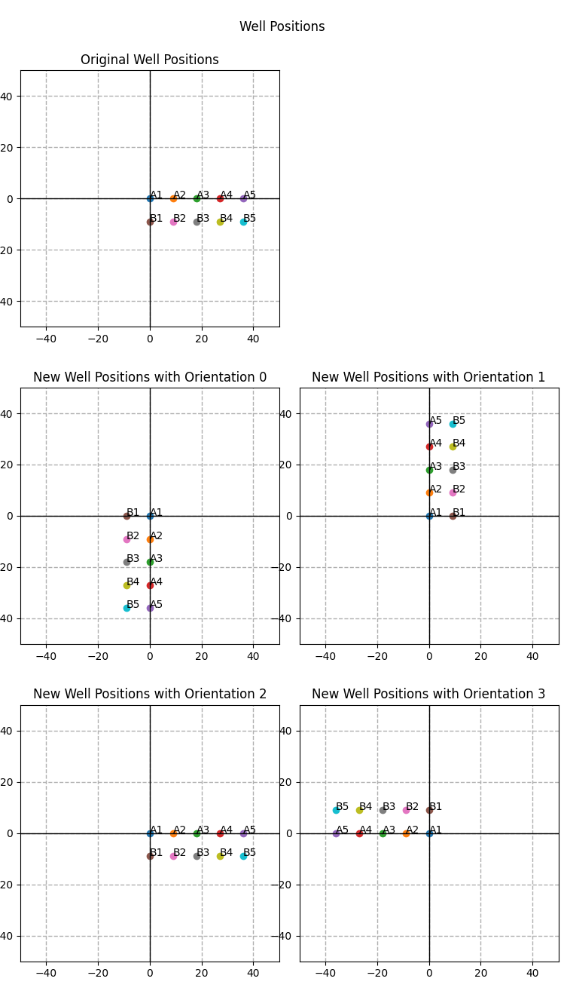

# Construction | [Installation](installation.md) | [End User Manual](end_user_manual.md) | [Dev User Manual](developer_manual.md) | [Contents](user_manual.md) <!-- omit from toc -->

## Table of Contnets <!-- omit from toc -->
- [Parts](#parts)

# Parts

For purchased parts please see [Bill of Materials (BOM)](documents/bom.md) for a parts list. It includes estimated prices and possible vendors to obtain the parts from (biased towards United States).

For 3D-Printed parts please see [3d files](files/3d_printed_parts.md)

# Constructing the Panda A Widget (PAW)

# Placing Objects on the Deck

## Vials

## Wellplates

When using the main menu to change the wellplate, you will be asked for the wellplate's a1 (XYZ) location and the orientation of the wellplate. Refer to the following figure to determine your wellplate orientation:

