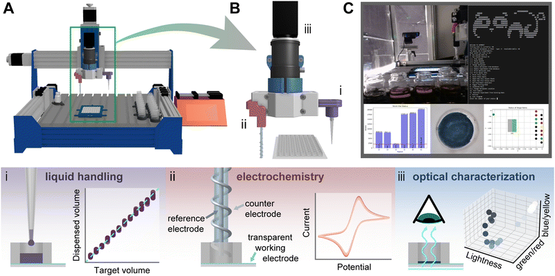

<!-- title: PANDA SDL Documentation -->

# PANDA SDL Documentation

# Intro

PANDA SDL, or "the PANDA", is an open-source SDL developed by Harley Quinn and Gregory Robben, in the [KABLab](https://www.kablab.org/) at [Boston University](https://www.bu.edu/). The PANDA electrodeposits and functionally characterizes polymer films using a combination of electrochemical and optical techniques (Fig. 1). Experiments are performed in a novel well plate architecture (which you can make yourself in the [Wellplate and Gasket SOP](sops/wellplate_and_gasket_SOP_v1.md)!) in which the transparent bottom of each well constitutes the working electrode while enabling transmission optical characterization.

## Navigation

1. [Construction](construction.md)
2. [Installation](installation.md)
3. [End User Manual](end_user_manual.md)
4. [Developer Manual](developer_manual.md)
5. [SOPs](sops/index.md)

## Legal

PANDA SDL - Python application for controlling polymer thin film deposition and
analysis robot.

Copyright (C) 2024 Gregory Robben, Harley Quinn

This program is free software; you can redistribute it and/or modify
it under the terms of the GNU General Public License as published by
the Free Software Foundation; either version 2 of the License, or
(at your option) any later version.

This program is distributed in the hope that it will be useful,
but WITHOUT ANY WARRANTY; without even the implied warranty of
MERCHANTABILITY or FITNESS FOR A PARTICULAR PURPOSE.  See the
GNU General Public License for more details.

You should have received a copy of the GNU General Public License along
with this program; if not, write to the Free Software Foundation, Inc.,
51 Franklin Street, Fifth Floor, Boston, MA 02110-1301 USA.

Contact: <brownka@bu.edu>
